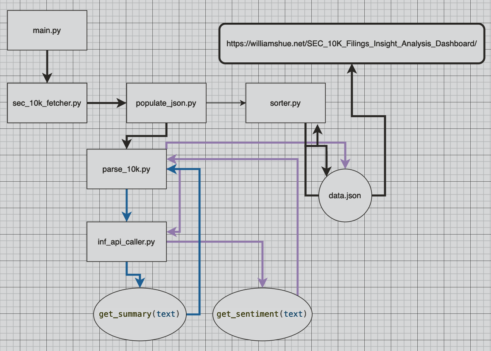

# SEC 10K Filings Insight Analysis Dashboard

Link to dashboard: [https://williamshue.net/SEC_10K_Filings_Insight_Analysis_Dashboard/](https://williamshue.net/SEC_10K_Filings_Insight_Analysis_Dashboard/).

*Why a user would care about this insight:* 

Positive weighted average of sentiment scores from SEC 10-K filings provide an indication of overall positive sentiment in a company's health.

Hugging Face was used becuase it was easy to use the free teir, however this required that text needed to be summarized and quantified with sentiment due to context window limitations. 

### Summary

This project was developed by William Shue, the dashboard can be used at: [https://williamshue.net/SEC_10K_Filings_Insight_Analysis_Dashboard/](https://williamshue.net/SEC_10K_Filings_Insight_Analysis_Dashboard/).

*note*: I would have loved nothing more than to use Chat GPT3.5/4 or Anthorpic's Claude Opus to generate textual insights; unfortunately I was unable to obtain free credits for those services. Most hugging face models have very small context winodws, which is why I used [human-centered-summarization/financial-summarization-pegasus](https://huggingface.co/human-centered-summarization/financial-summarization-pegasus) as the LLM to summarize the filings, and [cardiffnlp/twitter-roberta-base-sentiment](https://huggingface.co/cardiffnlp/twitter-roberta-base-sentiment) to generate sentiment scores.

*note*: Retrospectively I would have also desgined the dashboard to allow for the user to select the tickers and modified the backend to allow this.

## The Tech Stack 
I used the following tech stack to develop the web application. I selected the tools becuase I was familiar with them, they allowed efficent deployment of a lightweight web app which allowed for easily visualizing/interacting with the insights obtained leveraging the LLMs accessed via Hugging Face's Inference API.

### Backend:
**Python Scripts** which fetch data using the SEC EDGAR Downloader, clearn and orgainze the data, and make calls to **Hugging Face LLMs via the inference API** in order to get insights on the data; then storing everything in an orgainzed fashion in the data store.

### Datastore:
**The data.json file** which is modified and updated via the python scripts to allow for processing/visualizing data.

### Front End: 
**The index.html** document with contains vanilla **Java Script for allowing the webpage to be interactive** and **CSS for styling the webpage**. **Github pages was used for hosting**.

## How The Application Works

1. main.py calls the sec_10k_fetcher.py which obtains all SEC 10K filings for Apple, Microsoft and Amazon from 1995 to 2023.
2. main.py then calls populate_json.py 
3. populate_json.py then does the following for all filings obtained
- calls parse_10k.py to (clean/extract) get the plain text entries for three different sections of the 10k filings in question (blue line)
- uses an LLM to get a summary of the section of the filing via Hugging Faces inference API (blue line)
- uses a sentiment analyzer to get the sentiment of the summary via Hugging Faces inference API (purple line)
- Populates the data.json file with the text summaries extracted and the sentiment scores (purple line)
4. sorter.py sorts the json entries by company and year so they can appear sequentially in the webapp, this is becuase edgar doesn't download them in a stored sequential fashion
5. the html file with JS and css inside serve the webapp to the webapge hosted on github pages (the weighted averages of the sentiment scores are calculated here as well)

